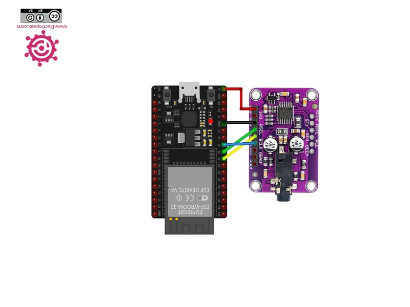
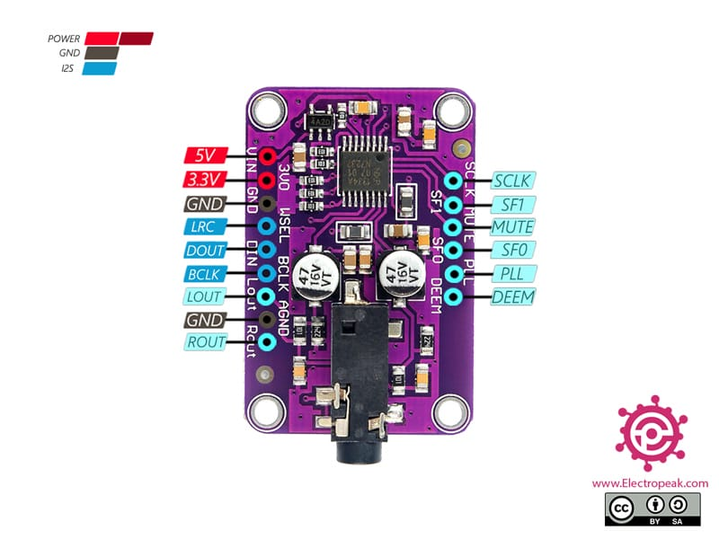
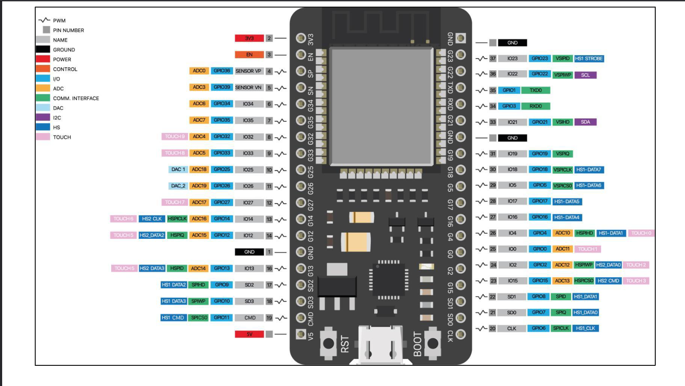

# geomancia synth

## initial project 
    https://github.com/schreibfaul1/ESP32-audioI2S

## next iteration will be here
https://github.com/cosmicAquarius/geomancia

# WCMCU-1334 UDA1334A I2S

## multiplexer

## esp32 attention spécifique
Attention ce modèle n'est pas standar le brochage n'est pas standar

### 🔌 Câblage 1x 74HC4067 (potentiomètres ou capacitif)

| Fonction      | GPIO   | Détail technique                   | Justification               |
| ------------- | ------ | ---------------------------------- | --------------------------- |
| `S0`          | **12** | Port 0, bit 12                     | Début du bloc sélecteurs    |
| `S1`          | **13** | Port 0, bit 13                     |                             |
| `S2`          | **14** | Port 0, bit 14                     |                             |
| `S3`          | **15** | Port 0, bit 15                     | Bloc complet S0–S3          |
| `EN0`         | **16** | Port 0, bit 16                     | Début bloc enable           |
| `EN1`         | **17** | Port 0, bit 17                     |                             |
| `EN2`         | **21** | Port 0, bit 21                     |                             |
| `EN3`         | **22** | Port 0, bit 22                     | Bloc `ENx`, tous sur port 0 |
| `SIG_IN`      | **36** | ADC1\_CH0 (entrée uniquement)      | Unique entrée analogique    |
| `MAX7219_CLK` | **4**  | disponible (prévu SPI2 / soft SPI) | Réservé                     |
| `MAX7219_CS`  | **2**  | disponible                         | Réservé                     |
| `MAX7219_DIN` | **0**  | disponible                         | Réservé                     |

|74hct4067|  MUX0  |   MUX1   |  MUX2 |  MUX3   |
| ------- | ------ | -------- | ----- | ------- |
|S0──────►| GPIO12 |  shared  |       |         |
|S1──────►| GPIO13 |  shared  |       |         |
|S2──────►| GPIO14 |  shared  |       |         |
|S3──────►| GPIO15 |  shared  |       |         |
|EN──────►| 16     | 17       |  21   |     22  |
|SIG─────►| GPIO36 (ADC)                        |
